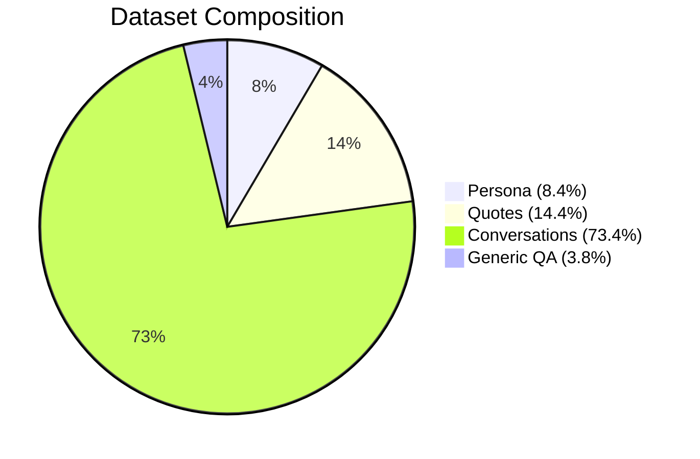

# AI-Inosuke Project

## 1. Data Collection & Preprocessing

The dataset was collected from multiple sources to replicate the **persona of Inosuke (Kimetsu no Yaiba)** in a natural way.  
All samples were normalized into the format:

```json
{"instruction": "...", "input": "...", "output": "..."}
```

### Dataset Statistics

| Source          | Samples |
|-----------------|---------|
| Persona         | 782     |
| Quotes          | 1,330   |
| Conversations   | 6,797   |
| Generic QA      | 350     |
| **Total**       | **9,259** |

**Dataset Distribution**



- **Persona** → Defines Inosuke’s characteristics, personality, and style.  
- **Quotes** → Preserves original voice lines from the anime/manga.  
- **Conversations** → Multi-turn dialogues, ensuring natural back-and-forth interactions.  
- **Generic QA** → Covers common questions, boosting generalization.  

---

## 2. Qwen2.5 Instruct + QLoRA 4-bit

| Criterion | Explanation |
|-----------|-------------|
| **Base Model** | [Qwen2.5-3B Instruct](https://huggingface.co/Qwen/Qwen2.5-3B-Instruct) – lightweight yet powerful for dialogue tasks, with strong multilingual support including Vietnamese. |
| **Technique** | **QLoRA 4-bit** significantly reduces memory usage while maintaining performance close to full precision fine-tuning. |
| **Resources** | Optimized for **6GB VRAM GPUs (RTX 3060, etc.)**, making it feasible without high-end hardware. |
| **Efficiency** | Great balance between quality and compute efficiency, enabling persona training at scale. |

**QLoRA Workflow**


---

## 3. Fine-tuning Process

- **Framework**: Hugging Face Transformers + PEFT + BitsAndBytes  
- **Training Strategy**:  
  - LoRA adapters with 4-bit quantization  
  - Mixed precision (fp16) for efficiency  
  - Supervised fine-tuning (SFT)  
  - EarlyStopping (patience = 2)  
- **Training Setup**:
  - Epochs: 6  
  - Optimizer: `paged_adamw_32bit`  
  - Learning rate: 2e-4 (cosine scheduler, warmup ratio 0.05)  
  - Batch size per device: 1  
  - Gradient accumulation: 16 (effective batch size = 16)  
  - Weight decay: 0.01  
  - Max sequence length: 512 tokens  
  - Eval split: 10% (train/test split = 90/10)  

### Training Metrics

| Epoch | Training Loss | Eval Loss | Time per Epoch |
|-------|---------------|-----------|----------------|
| 1     | 4.04 → 1.56   | 1.56      | ~00:12:34      |
| 2     | 1.56 → 1.47   | 1.47      | ~00:12:28      |
| 3     | 1.47 → 1.42   | 1.42      | ~00:12:15      |
| 4     | 1.42 → 1.40   | 1.40      | ~00:12:09      |
| 5     | 1.40 → 1.39   | 1.39      | ~00:12:01      |
| 6     | 1.39 → 1.38   | 1.38      | ~00:11:58      |

**Loss Curve Visualization**

```mermaid
line
  title Training vs Eval Loss
  x-axis [1, 2, 3, 4, 5, 6]
  y-axis "Loss"
  series "Training Loss" [4.04, 1.56, 1.47, 1.42, 1.40, 1.39]
  series "Eval Loss" [1.56, 1.47, 1.42, 1.40, 1.39, 1.38]
```

Both training and evaluation loss decrease steadily → good convergence, no major signs of overfitting.  
EarlyStopping ensures unnecessary epochs are skipped if no improvement.  
Logging integrated with TensorBoard (`tensorboard --logdir=./logs`).  

---
