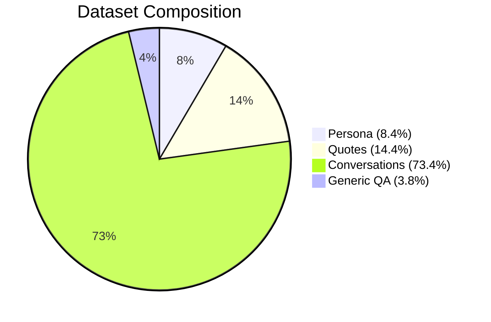

# Inosuke-AI Fine-tuning Project

## 1. Data Collection & Preprocessing

The dataset was collected from multiple sources to replicate the **persona of Inosuke (Kimetsu no Yaiba)** in a natural way.  
All samples were normalized into the format:

```json
{"instruction": "...", "input": "...", "output": "..."}
```

### Dataset Statistics

| Source          | Samples |
|-----------------|---------|
| Persona         | 782     |
| Quotes          | 1,330   |
| Conversations   | 6,797   |
| Generic QA      | 350     |
| **Total**       | **9,259** |

**Dataset Distribution**



- **Persona** → Defines Inosuke’s characteristics, personality, and style.  
- **Quotes** → Preserves original voice lines from the anime/manga.  
- **Conversations** → Multi-turn dialogues, ensuring natural back-and-forth interactions.  
- **Generic QA** → Covers common questions, boosting generalization.  

---

## 2. Why Qwen2.5 Instruct + QLoRA 4-bit?

| Criterion | Explanation |
|-----------|-------------|
| **Base Model** | [Qwen2.5-3B Instruct](https://huggingface.co/Qwen) – lightweight yet powerful for dialogue tasks, with strong multilingual support including Vietnamese. |
| **Technique** | **QLoRA 4-bit** significantly reduces memory usage while maintaining performance close to full precision fine-tuning. |
| **Resources** | Optimized for **6GB VRAM GPUs (RTX 3060, etc.)**, making it feasible without high-end hardware. |
| **Efficiency** | Great balance between quality and compute efficiency, enabling persona training at scale. |

**QLoRA Workflow**

```mermaid
flowchart LR
    A[Base Model Qwen2.5-3B Instruct] --> B[Quantization (4-bit NF4)]
    B --> C[LoRA Fine-tuning Layers]
    C --> D[Inosuke Persona Fine-tuned Model]
```

---

## 3. Fine-tuning Process

- **Base model**: `Qwen2.5-3B-Instruct`  
- **Method**: QLoRA (4-bit quantization, LoRA adapters)  
- **Hardware**: RTX 3060 6GB VRAM  
- **Dataset size**: 9,259 samples  
- **Training output**: `D:\AI-Inosuke\models\inosuke-lora\checkpoint-2605` (best checkpoint)  

### Training Format

During fine-tuning, prompts followed this template:

```text
if inp and inp.strip():
    text = f"### Instruction:\n{instr}\n\n### Input:\n{inp}\n\n### Response:\n{out}"
else:
    text = f"### Instruction:\n{instr}\n\n### Response:\n{out}"
```

### Example (multi-turn conversation)

```json
{
  "instruction": "A multi-turn dialogue about a crow.",
  "input": "You: Do you often look at the sky to remember the crow?\nInosuke:",
  "output": "Yes, whenever I see a bird shadow I look up! I think it’s back.\nYou: And when you realize it’s not?\nInosuke: I get mad and yell! Then sigh again."
}
```

---

## 4. Results 

Model successfully fine-tuned with limited GPU memory.  
Supports single-turn and short multi-turn dialogues.  
Persona-aligned responses consistent with Inosuke’s style.  

